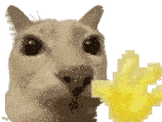

### Mahlzeit 👋

I use this website to upload code of programs that I either needed myself or whose programming or functionality interests me. I believe software should be free and open, so feel free to reuse my code for anything you want. If you do use my code in a public project, a mention is by no means necessary, but I would be very happy to see where my code has ended up. Also, check out [this very sleepy cat](https://www.youtube.com/watch?v=Z1UWsBJ5HgU)

  

<!--
**NieckLikesCode/NieckLikesCode** is a ✨ _special_ ✨ repository because its `README.md` (this file) appears on your GitHub profile.

Here are some ideas to get you started:

- 🔭 I’m currently working on ...
- 🌱 I’m currently learning ...
- 👯 I’m looking to collaborate on ...
- 🤔 I’m looking for help with ...
- 💬 Ask me about ...
- 📫 How to reach me: ...
- 😄 Pronouns: ...
- ⚡ Fun fact: ...
-->
